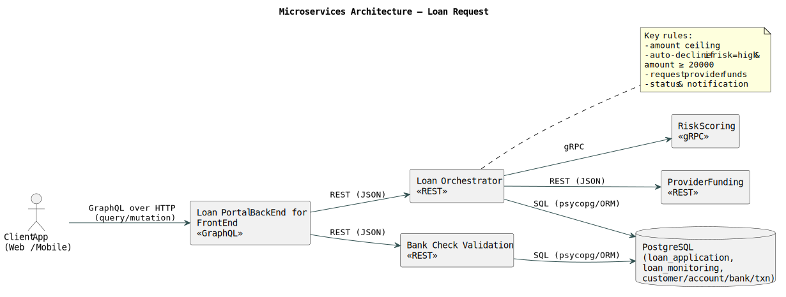
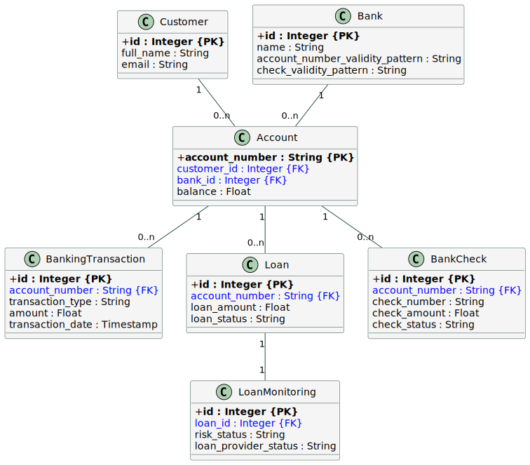

# Loan Simulation Service — README

A microservices playground in Python (FastAPI, Strawberry GraphQL, gRPC stub) orchestrated with Docker Compose, backed by PostgreSQL, and optionally driven by Camunda 8 (Web Modeler + Connectors) for BPMN tests.

## 🧩 Architecture

### 1) Loan Portal Backend For Frontend (GraphQL)

Role :

- Single facade for front/back office.

- Aggregates calls to Loan Orchestrator / Check Validation services.

Exposure :

- POST /graphql (Strawberry queries & mutations).

Key operations :

- getLoanInformation(loan_id) / getCheckInformation(check_number) (Query)

- requestLoan(input) / depositCheck(input) (Mutations)

I/O :
- requestLoan (calls *Loan Provider*) :
    - Input: typed GraphQL variables.

    - Output: aggregated GraphQL types tailored to the UI.

- depositCheck (calls *Check Validation*) :
    - Input: typed GraphQL variables.

    - Output: aggregated GraphQL types tailored to the UI.

Dependencies :

- loan_orchestrator, bank_check_validation.

Why GraphQL ?

- Client-driven queries, no over/under-fetching, one round trip.

### 2) Loan Orchestrator (REST)

Role :

- Drives the loan lifecycle end-to-end.

- Validates limits/bank/account, calls Risk Scoring, triggers Provider Funding.

- Updates status and persists results.

Exposure :

- POST /loans/request (requestLoan)

- GET /loans/{loan_id} (getLoanInformation)

I/O :
- requestLoan (calls *Risk Provider* and *Provider Funding*) :
    - Input: { account_number, loan_amount }

    - Output: { success, message, loan{...} }

Owned data : 

- loan, loan_monitoring

Dependencies :

- risk_scoring (gRPC), provider_funding (REST), db

Why REST ?

- Standard, interoperable, easy to expose to external clients/partners.

### 3) Bank Check Validation (REST)

Role :

- Validates cashier’s checks (bank pattern, account existence, sufficient balance).

Exposure :

- GET /checks/{check_number}

- POST /checks/deposit (deposit_check)

I/O :
- deposit_check :
    - Deposit input: { account_number, check_number, check_account_number, check_amount }

    - Deposit output: { success, message, check_id }

- Get output: { id, check_number, account_number, check_amount, check_status }

Reads data :

- bank, account, bank_check

Dependencies :

- PostgreSQL

Why REST ?

- Synchronous validations, trivial to integrate from BFF/Orchestrator.

### 4) Provider Funding (REST)

Role :

- Simulates funding requests and returns a transfer receipt (in-memory stub).

- Adds funds to the given account's balance

Exposure :

- POST "/" (requestFunds)

I/O :

- requestFunds :
    - Input: { account_number, amount }

    - POST output: { ok (bool), message }

Dependencies : 

- None

Why REST ?

- Minimal side-effecting action with simple HTTP semantics.

### 5) Risk Scoring (gRPC)

Role :

- Evaluates/simulates customer risk based on account/transaction context.

Exposure :

- gRPC method (AnalyzeRisk)

I/O :
- AnalyszeRisk :
    - Input: account identifiers and derived metrics.

    - Output: { riskLevel: LOW|MEDIUM|HIGH } + decision (APPROVE|REJECT|REVIEW).

Dependencies :

- None

Why gRPC ?

- Efficient, strongly-typed internal RPC for service-to-service calls.

### 6) DB (PostgreSQL)

Role :

- System of record for entities and history.

Key schema :

Integrity :

- Uniqueness, FKs, triggers (updated_at), validation via regex patterns.

Bootstrap :

- db/init.sql (schema), db/sample_data.sql (seed)

### Docker Network
All containers join the loan_app_backend Docker network.

### Sequence Diagram

## 🔧 Prerequisites

You will need Docker & Docker Compose.

Inside Docker, services call each other via service names (e.g. bank_check_validation) and container ports (e.g. 8180), not localhost.

## ▶️ Run
### 1) Ensure the shared network exists
docker network create loan_app_backend || true

### 2) Configuration
You will need to configure a ***.env*** file at the root of the project following the ***.env_example*** file.

### 3) Build & start
You can use the run.sh file at the root of the project

./run.sh

### 4) [*Optional*] Reset Database

docker volume -rm loan_db_data   # removes the loan_db_data volume

docker compose up -d --build

## 🗄️ Database

**db/init.sql** – creates schema, constraints, triggers.

**db/sample_data.sql** – seeds demo data (banks, customers, accounts, transactions, a sample check).

Executed automatically at first startup by Postgres’ entrypoint.

# 🤝 Using the Service with Camunda 8

You can use Web Modeler Self-Managed for design only, or bring up Zeebe + Connectors to actually run processes. Ensure Camunda containers join the same loan_app_backend network so they can reach your services by DNS name.

- Operate: http://localhost:8081
- Tasklist: http://localhost:8082
- Optimize: http://localhost:8083
- Identity: http://localhost:8084
- Web Modeler http://localhost:8070
- Elasticsearch: http://localhost:9200

## A) Network sanity check
docker network ls | grep loan_app_backend
docker network inspect loan_app_backend

You should see both your app services and Camunda services (e.g., connectors, zeebe) attached.

## B) Example BPMN tests

You can find example BPMN tests' XML files in Documentation/Tests along with Screen Captures.

## C) Cluster endpoint (to run processes)

In Web Modeler → Implement:

Cluster endpoint: http://zeebe:26500

Make sure Connectors are running; otherwise the HTTP template won’t execute.